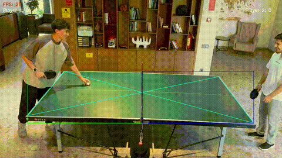

# Table Tennis Ball Detection



This project presents a computer vision system designed to detect and analyze table tennis ball trajectories and key game events from video footage. Leveraging the Ultralytics YOLOv8 model for precise ball detection, it integrates custom logic to track ball bounces, net hits, and dynamically update player scores in real-time.

---

## Features

- 🎯 Accurate detection of the table tennis ball within video frames using a trained YOLOv8 model.  
- 🔄 Continuous tracking of the ball’s trajectory throughout gameplay.  
- ⚡ Recognition of critical events such as bounces on either player’s side, net hits, and out-of-bounds occurrences.  
- 📊 Visual overlay of scores and detected events directly on video frames.  
- ⚙️ Interactive setup for defining table corners and net position.  
- 🎥 Output of annotated videos illustrating detected events.  

---

## Model Performance Metrics

| Metric           | Value     |  
|------------------|-----------|  
| Precision (B)    | 0.9768    |  
| Recall (B)       | 0.7647    |  
| mAP50 (B)        | 0.9015    |  
| mAP50-95 (B)     | 0.4671    |  
| Fitness          | 0.5106    |  

*B = Ball class*

These metrics represent the evaluation results of the trained YOLOv8 ball detection model on the validation dataset.

---

## Repository Structure

```
├── configs/                 # Configuration files (e.g., data.yaml)  
├── Dataset/                 # Images and annotations for training and validation  
├── Models/                  # Trained model weights  
│   └── best.pt  
├── Scripts/                 # Main Python scripts  
│   ├── analyze_tennis_game.py   # Real-time game analysis  
│   ├── evaluate_model.py         # Model evaluation script  
│   └── train_model.py            # Model training script  
├── Videos/                  # Sample videos (not included due to size limitations)  
├── media/                   # Demo GIFs and media assets  
├── requirements.txt         # Python dependencies  
└── README.md                # Project overview and documentation  
```

---

## Installation

1. **Clone the repository:**

   git clone https://github.com/Rahimdzx/table-tennis-ball-detection.git  
   cd table-tennis-ball-detection  

2. **(Optional) Create and activate a Python virtual environment:**

   python -m venv venv  
   # On Linux/macOS:  
   source venv/bin/activate  
   # On Windows PowerShell:  
   .\venv\Scripts\activate  

3. **Install required dependencies:**

   pip install -r requirements.txt  

---

## Usage

- **Train the model:**

  python Scripts/train_model.py  

- **Evaluate the model:**

  python Scripts/evaluate_model.py  

- **Analyze a tennis game video:**

  python Scripts/analyze_tennis_game.py  

> **Note:**  
> Paths to datasets, model weights, and video files should be adjusted in the scripts or configuration files to match your local setup.

---

## Notes

- Due to GitHub file size restrictions, video files are excluded from the repository.  
- You can add your own videos inside the `Videos/` folder and update the script paths accordingly.  
- A short demo GIF is included in the `media/` folder to showcase the system in action.

---

## Contact

📧 Email: mouissatrabah@gmail.com  
💬 Telegram: @rahim2330

---

Thank you for your interest in this project. Enjoy exploring and enhancing your table tennis analytics! 🎾
